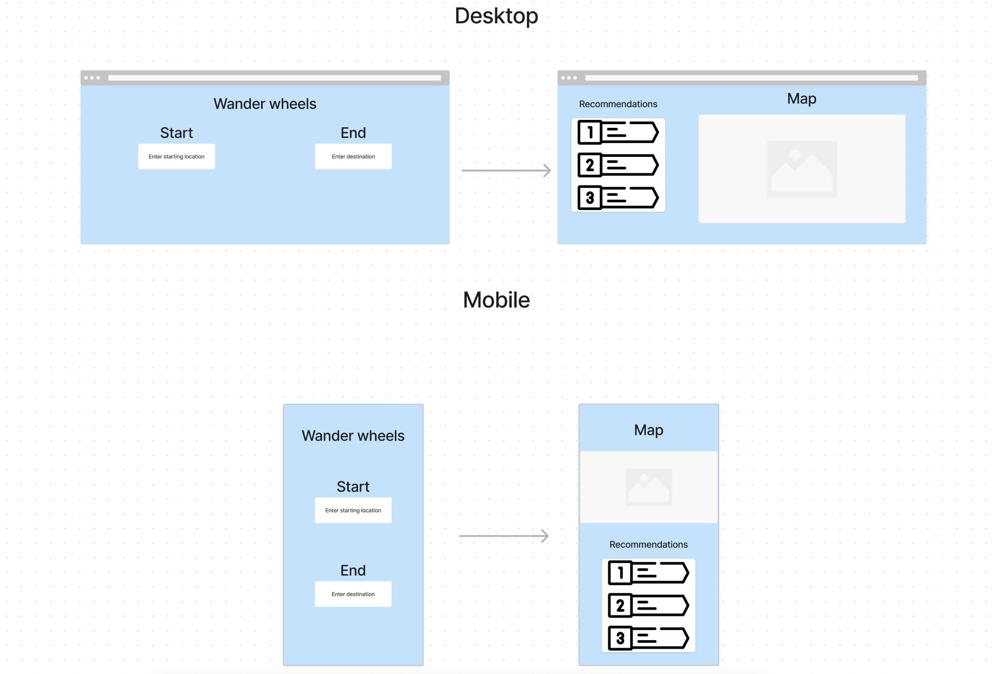

# Wander Wheels

Created by Aaron Castillo and Cris Martinez.

## 🚀 Mission statement

Our application, Wander Wheels is for people wanting a new found sense of exploration. It allows users to input two locations, a start and end destination, where they get drawn a rotue to which to go on along with alternative routes to their destination.

## API

This application will use the Map Quest API. Below are the documentation and specific endpoints we intend to use.

- Link to API documentation: [Api](https://developer.mapquest.com/documentation/searchahead-api/)
- API endpoint #1
  - https://www.mapquestapi.com/directions/v2/route?key=KEY&from=Clarendon_Blvd,Arlington,VA&to=2400+S+Glebe+Rd,+Arlington,+VA
- [API endpoint #2] - “https://www.mapquestapi.com/directions/v2/alternateroutes?key=KEY&from=Denver,CO&to=Golden,CO&maxRoutes=2&timeOverage=100”
  - Destination address
- [API endpoint #3] - "https://www.mapquestapi.com/search/v4/place"
  - Search for POIs, center, radius, querey

**The API requires a key**

## 👩‍💻 MVP User Stories

The core features of the application include:

- Users can input two locations, a start and an end location
- Users can get a route planed for them to go on a road trips
- Users can recieve the distance of the road trip, and how long it would take to get there

## 🤔 Stretch User Stories

If time permits, the following stretch features will be implemented in order of priority:

- Users will be able to interact with the map to set the start and end destinations
- Users will be able to get shown points of interest (POI) on the route
- Users will be able to adjust the number of POIs they wish to go and visit
- Users will be able to see the POIs on the side of the map in block type display
- Users will be able login / sign up with an account
- Users will be able to add pictures of their favorite moments on the trip

## 📆 Timeline for reaching MVP in 1 week

To ensure that we can complete all core features of the application in 1 week, we will aim to complete tasks according to the following timeline:

**Day 1**

- [ ] A vite project made with react
- [ ] All components and overall layout complete

**Day 2**

- [ ] Make sure we do not run out of free calls (**NO INFINITE LOOPS**)
- [ ] Make a form to fetch with
- [ ] Fetch from all API endpoints successful
- [ ] Includes destination, route, and time estimate of journey

**Day 3**

- [ ] Render route to page
- [ ] Render POIs to page
- [ ] Work on algorithm to implement other landmarks and attractions along the route
- [ ] A color pallet is decide
- [ ] A mood board for inspiration is used

**Day 4**

- [ ] Work on CSS
- [ ] Make responsive
- [ ] Work on mobile version
- [ ] Maybe some animations depending on time
- [ ] Impliment color pallet

**Day 5**

- [ ] Work on bugs (there will be a lot)
- [ ] Begin implementing stretch features starting from top of list
- [ ] Have others test site (user testing)

## Wireframes of each page in your application

Below, you can find wireframes for our project. Each wireframe shows a different page of our application as well as the key components of the application. Details such as specific text values or images are intentionally not included:

